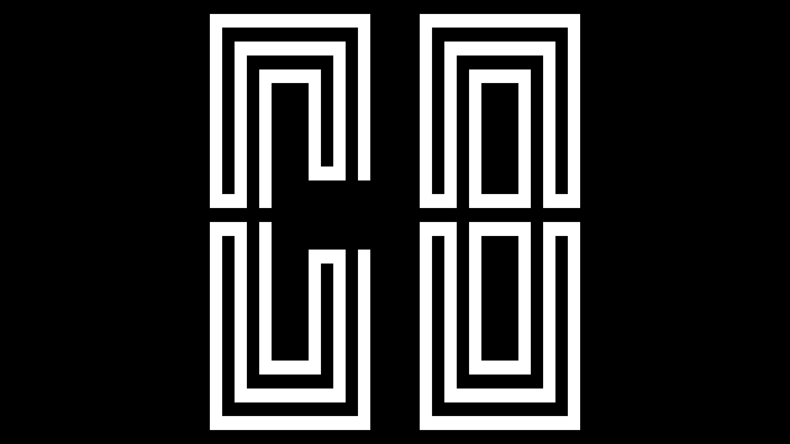

# CHIP-8-Emulator
A CHIP-8 emulator in C++

## Compiling and Running
* note: this is only tested on linux(Arch BTW) im not sure about other platforms.
* you need to have libsdl2 in order to compile the code

## References
Some helpful resources I used when writing this

- https://www.youtube.com/watch?v=yFLa3ln16w0
- http://devernay.free.fr/hacks/chip8/C8TECH10.HTM#Annn

